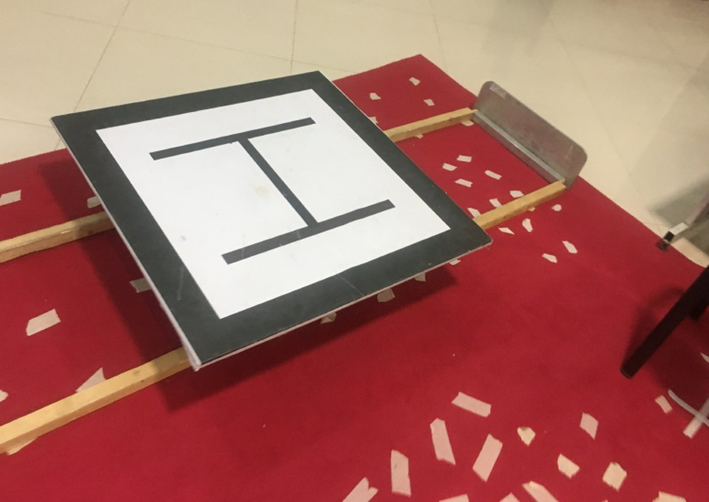

# Bebop-Find-the-Landing-Pad
A project on auto navigating and landing on the center of the detected landing platform 

The target moving landing pad here was 30 above the ground, when using, desired altitude, camera angle and the distance of the target in relation to camera's angle changes may be changed.

This code was used in Robocup Asia Pacific 2018 and our team, MRL, came first place in UAV competition. 
